# Sieci Mobilne i Sieci Internetu Rzeczy

B - Blok

C - Część

> 5G to będzie rewolucja w telekomie, bo każda fabryka będzie chciała swoją sieć 5G, która jest superszybka (minimalne opóźnienia), żeby powstawały inteligentne fabryki.

# B0 Sieci komórkowe - wstęp

### Ewolucja od 2G do 5G - Timeline

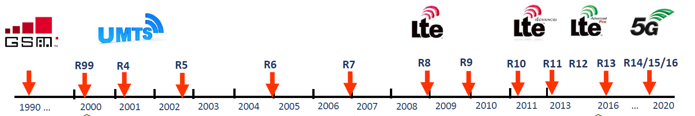

Każde R, to kolejny Release. Aktualnie trwają pracę nad R17, ale to na papierze

#### 2G - GSM

W Polsce trochę później niż 1990. Ofc wcześniej były inne technologie np. w USA, ale o tym się już nie mówi.

W GSM można było usługi pakietowe, ale to było mega wolne wiele niedogonodności.

Poźniej weszło GPRS i EDGE, gdzie pakietowa usługa została podniesiona do rangi architektonicznego komponentu. Bo w GSM, robiło się transmiję pakietową w kanale rozmównym, więc to nie mogło być szybkie (kilkanaście kb/s). Natomiast w 2.5G (GPRS i EDGE), gdzie podniesiono usługę pakietową do rangi architektury i wytworzyło strukturę sieci rdzeniowej, która de facto jak przyjżeć się klockom pomijając szczegółowe nazwy i inne protokoły jakie są używane, to tak naprawdę przetrwała ona do 4G na pewno, a może i jak się trochę poumawiamy to 5G.

#### 3G - UMTS

Inny sposób kodowania.

Zwiększono przepływność usług pakietowych o rząd wielkości co do 2.5G. Później dorabiano kolejne ficzery, powiększano pasmo. 

Potem zrobiono HSPA, czyli zwiększenie przepływności, ale architektoniczne na tej samej sieci.

#### 4G - LTE

Koniec 2008 pierwsza wersja LTE, czyli to czego używamy dzisiaj. OFDM. - zmiana modulacji, bo w tej wcześniejszej nie dało się nic zrobić (pod Shannona podeszli  i trzeba było inaczej to wymyśleć).

Potem kolejne ficzery agregacja nośnych - czyli LTE4Dvanced. 

Gdzieś R12,R13 pojawiły się standardy *narrow band IoT* i *LTE-M* do obsługi sieci Internetu rzeczy. Niewiele tego wzdrożono (zwłaszcza w Polsce).

> Orange oferuje narrow band IoT, a Plus LTE-M. Ale świadczą takie usługi tylko firmom i to dużym.

#### 5G

5G kolejna instancja. To nie jest tak, że powstało to z niczego i zupełnie przerwało tradycję, historię tego wszystkiego. Po prostu to są kolejne ficzery, które swoją skalą i znaczeniem spowodowały, że nazwano to zupełnie inaczej - 5G (bo pewną masę krytyczną tych ficzerów przekroczono). 

Zmniejszono opóźnienia w radiówce do rzędu 1ms (zmiana procedur obsługi ruchu).

Małe stacje bazowe, wysokie pasma częstotliwościowe.

#### Technologie i ich obszary

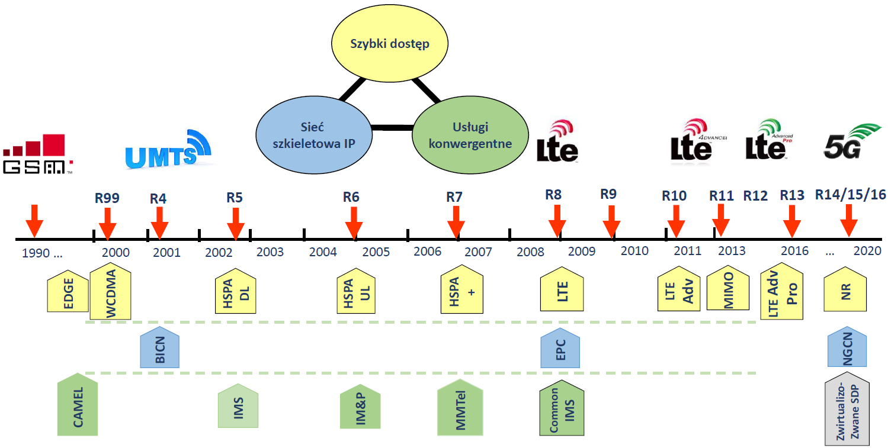

**IMS** - **IP Multimedia Subsystem** - baza dla obecnej rzeczy jaką jest VoiceOverIP, czyli usługi głosowe na LTE. 
Operator większość z nas usługi głosowe nie wrzuca już na UMTS tylko na VoIP.

### Architektury

W ogólności sieć mobilna zawsze ma dwie sekcje

- Radiowa sieć dostępowa
  - **RAN** - Radio Access Network
  - jest po to, żeby przez łącze radiowe przenieść odpowiednie sygnały (niezawodnie itd. itd.)
  - nie zajmuje się usługami *per se*
  - taka niska wartstwa (tylko przesyła a usgługami to się endpointy zajmują -  z jednej strony terminale, z drugiej sieć szkieletowa)
- Sieć szkieletowa
  - **Core** - Core Netowork
  - ona zajmuje się realizacją usług pod kątek użytkownika
- No i są jeszcze terminale (urządzeni końcowe, te w rękach klienta)

Taki podział obowiązuje przez wszystkie generacje zmieniają się tylko bloczki w środku.

#### 2G - GSM

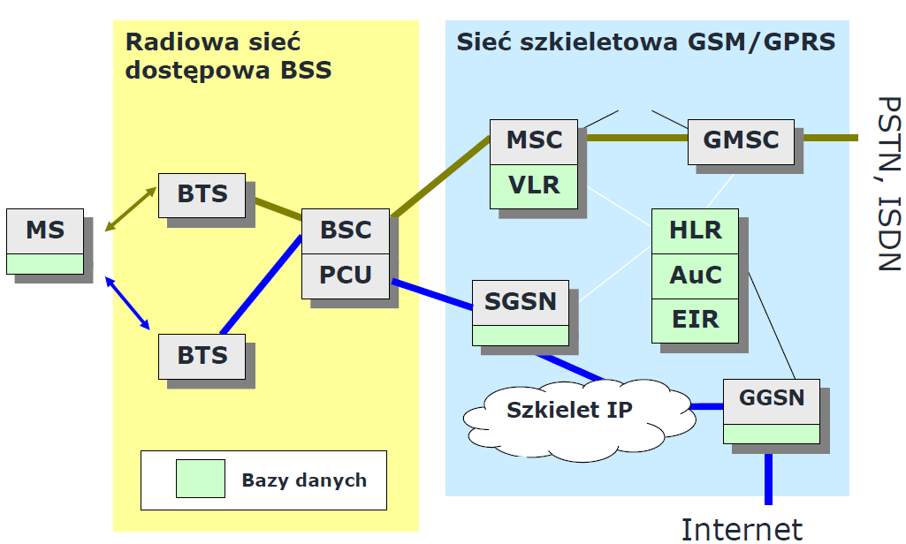

MS - Mobile Station (czyli terminal)

BTS - Base Transceiver Station

#### 3G - UMTS

  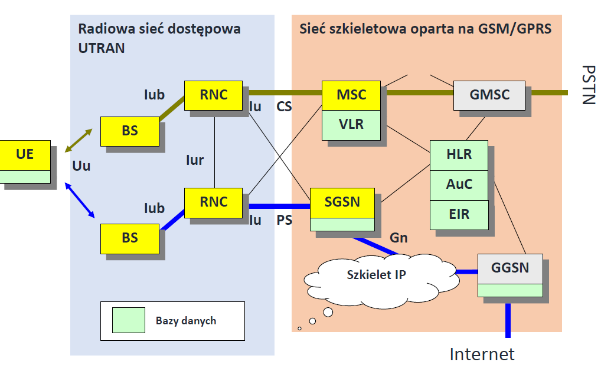

**Release 99**

Zmiany w RAN:

- UE - User Equipment (czyli terminal)

- Nowy interfejs radiowy opary o WCDMA

- BSC (Base Station Controller) przechodzi w RNC (Radio Network Controller)

Zmiany W CORE:

- MSC -> 3G MSC
- SGSN -> 3g SGSN
- GMSC i GGSN bez zmian
- AuC zmodernizowany (większe bezpieczeństwo)

**Release 4**

O ile bloki są podobne w RAN, to już sygnalizacja w nich jest inna, bo w UMTS inne kodowanie weszło.

Pierwsze releas'y UMTS pracowały z ISDN, potem trzeba bylo przejść na ATM i IP, więc kolejne releas'y dodawały swoje 5gr w tym temacie. Siecią transportową przestawała być stara SDN, tylko pakietówki. I właśnie jak świat zaczął przechodzić na pakietówki, to pomyślano, że sieć komórkową też na pakietówkę hyc, ale jak to zrobić? Pakiet to zupełnie co innego niż stały kanał o stałej przepływności PCM-kowy i okazało się, że dół węzłów trzeba zmodyfikować i okazało się, że nawet architektonicznie można to inaczej zrobić, a nawet warto.

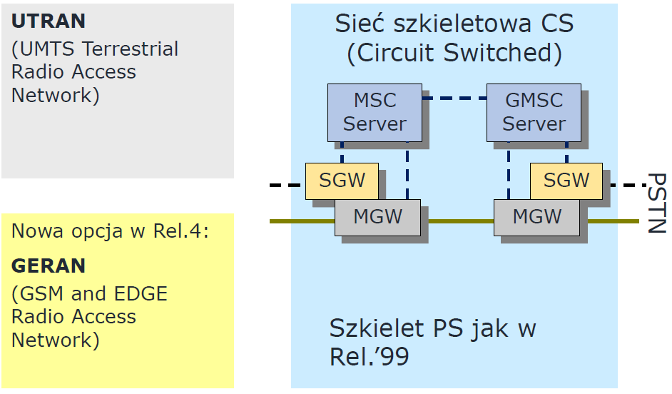

**Release 5**

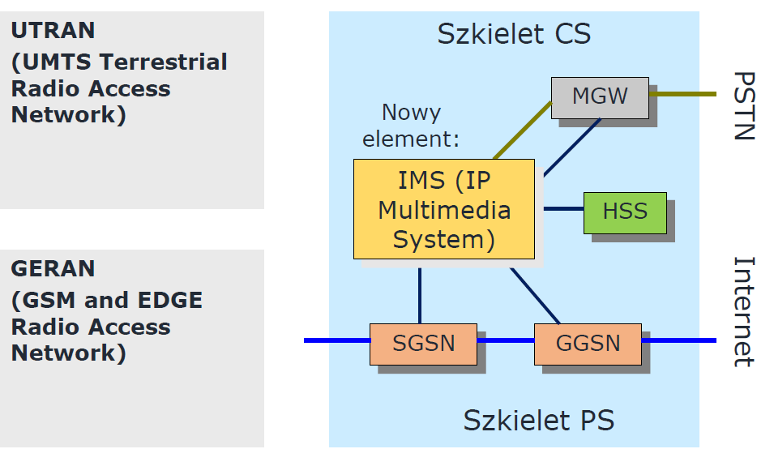

Pojawisło się **3G HSPA** (**H**igh Speed **P**acket **A**ccess). Nowa technologia do zwiększania przepływności bitowej (znacznie!!), którą sprzężono z sieciami Wi-Fi. Ale na tej samej strukturze co 3G, więc bez żadnej tam rewolucji.

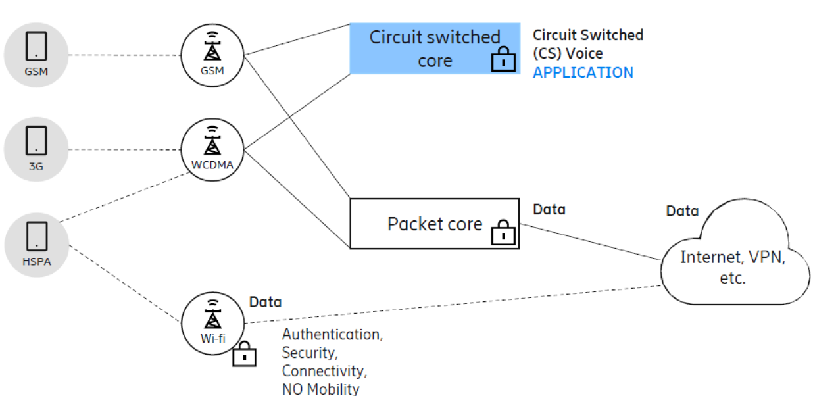

Ile ta technologia dała przepływności?

|            | Downlink  |    Uplink    |
| :--------: | :-------: | :----------: |
| Release 5  | 14.4 Mb/s |  5.76 Mb/s   |
| Release 7  |  28 Mb/s  |  11.5 Mb/s   |
| Release 8  |  42 Mb/s  | 23 Mb/s (R9) |
| Release 10 | 168 Mb/s  |      -       |
| Release 11 | 336 Mb/s  |   70 Mb/s    |

#### 4G -  LTE

UTMS Release 8 to jest LTE/EPC

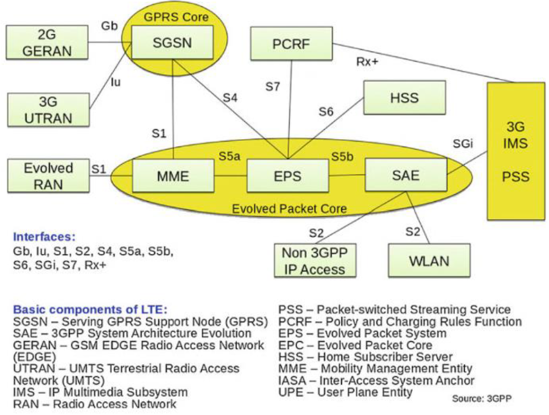

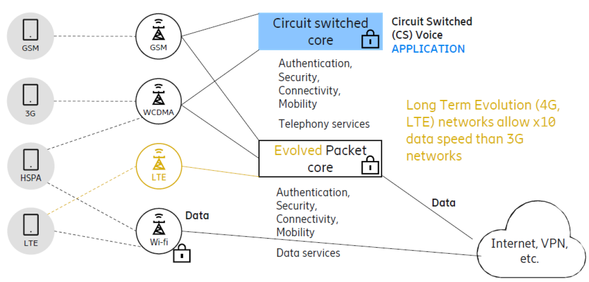

### Różne tematy

#### Ewolucja UMTS ku SDN/NFV

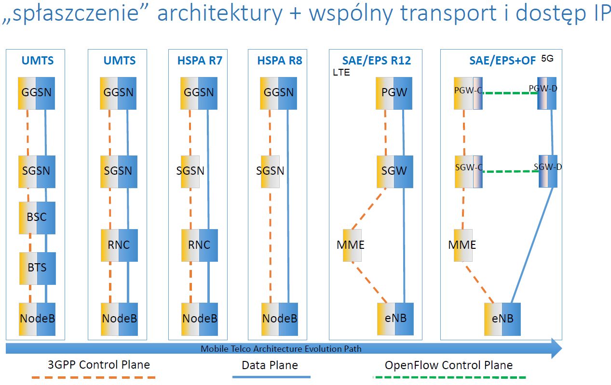

**Data Plane** - moja mowa, dane użutkownika (Dane pakietowe)

**Control Plane** - protokoły do wysterowania (przygotowanie węzłów po drodze, do przekazania danych) Data Plane (Sygnalizacja/Sterowanie)

Widać jak na początku szło to przez jedne urządzenia, a potem zaczęły one się specjalizować np. w LTE wydzelono MME (Mobilty Management Element) osobny serwer, przez który dane głosowe nie przechodzą wgl., a on czuwa nad obsługą mobilności userów (hand-overy realizuje).

A w 5G zupełnie oddzielono Data i Control Plane. Niebieskie to rutery, a zółte to serwery. W dzisiejszych czasach w 5G, te serwery zaczynają być zwirtualizowane, to jest realizowane w chmurze. Sterowanie jest ez zwirtualizować, router już nie, bo tam lecą miliony danych.

#### Komutacja kanałów jako rezerwa, Dane - LTE, ugługi głosowe - w trybie CS

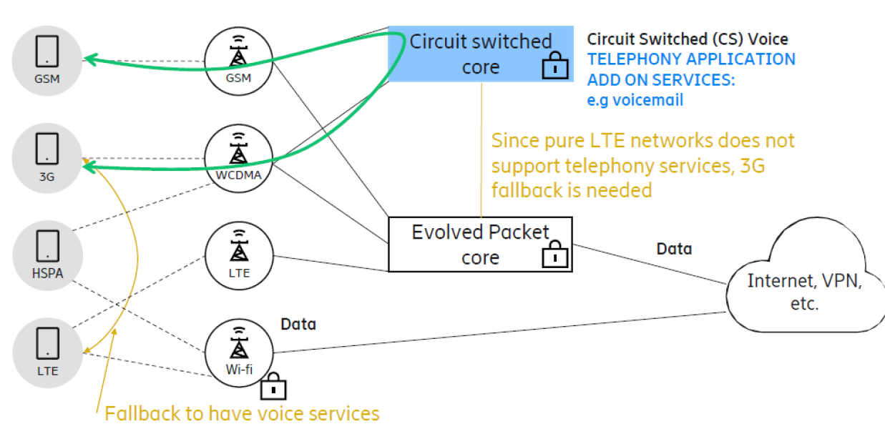

To nie jest tak, że jak operator wprowadzał nową technologie (nowe G), to kasował poprzednią. W Twoim telefonie działa 2G, 3G, 4G. 

I naprzykład sieć GSM backapuje inne, wyższe technologie w zakresie usług głosowych. A są obszary (małe ale są, bieszczady czy coś), gdzie działa tylko 2G np.

#### IMS- scentralizowany model usług

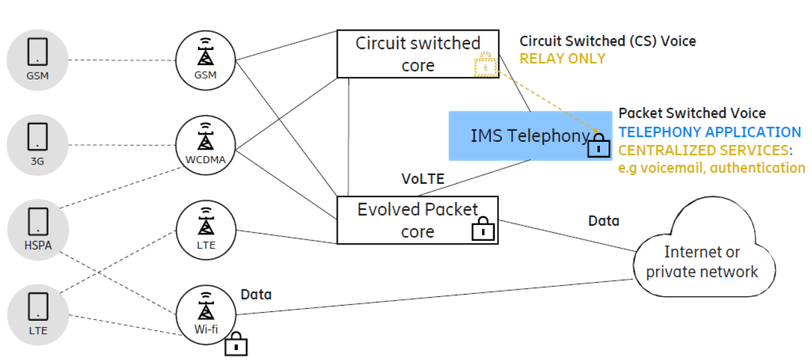

Warto zwrócić uwagę, na to że VoLTE jest na IMS.  IMS to skomplikowanty podsystem, który wspiera działanie usług głównie głosowych. 

Większość ludzi ma głos po VoLTE i za syngalizację odpowiada tam IMS (jakieś tam serwery, w chmurze, które służą do zestawiania naszych sesji głosowych).

#### 4G LTE - kluczowe techniki

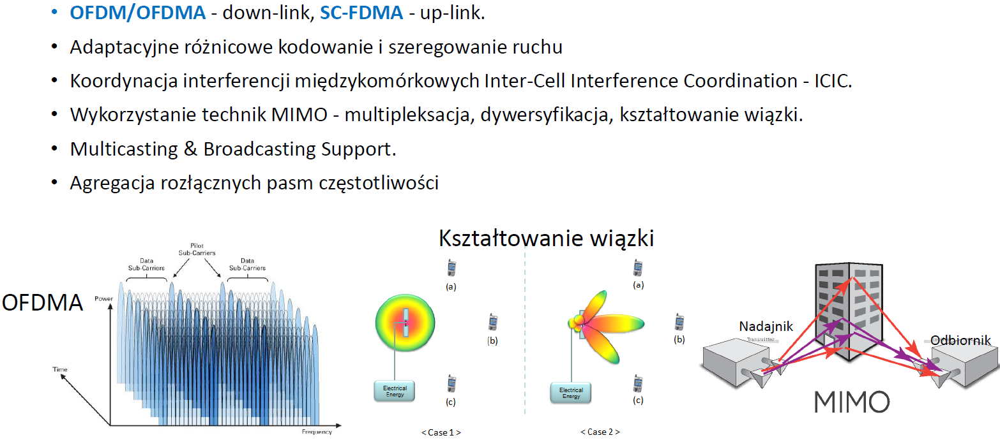

#### Ewolucja LTE - szybkośc transmisji

LTE to czas gdzie zaczęto wprowadzać wielo-antenowe rozwiązania tzw. **MIMO** - Multiple Input Multiple Output.

LTE zaczęło się od 150Mb/s i ciągłego pasma 20MHZ. a w 2017 układy scalone w terminalach przystosowane są do 1Gb/s i wykorzystania pasma 80-100MHz w kierunku od sieci do usera.

| Rok      | 2012                | 2013                  | 2014                  | 2015             | 2016       | 2017                    |
| -------- | ------------------- | --------------------- | --------------------- | ---------------- | ---------- | ----------------------- |
| Szybkość | 150 Mb/s            | 150 Mb/s              | 300 Mb/s              | 450 Mb/s         | 600 Mb/s   | 1 Gb/s                  |
| Pasmo    | 20 MHz 2x2MIMO | 10+10MHz 2x2MIMO | 20+20MHz 2x2MIMO | 3CA 2x2MIMO | 3CA 256QAM | 3-5CA Mhz  4x4MIMO |

xCA - Carrier Aggregation x- number of aggregated carriers

MIMO - Multiple Input Multiple Output.

xQAM - Quadrature Amplitude Modulation x - number of combinations

### Ewolucja od 1G do 4G

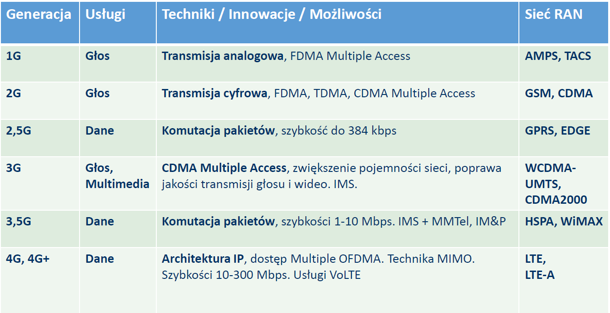

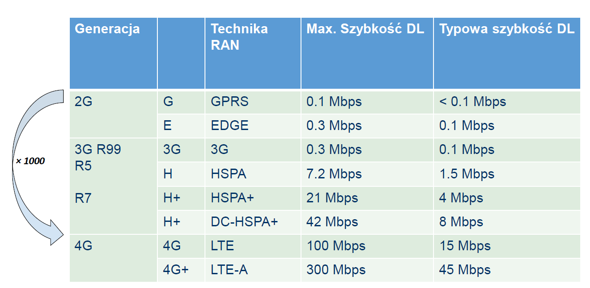

*Nie ma możliwość, żeby wszyscy userzy w komórce mieli `Max. Szybkość DownLink`, bo pasma nie wystarczy.

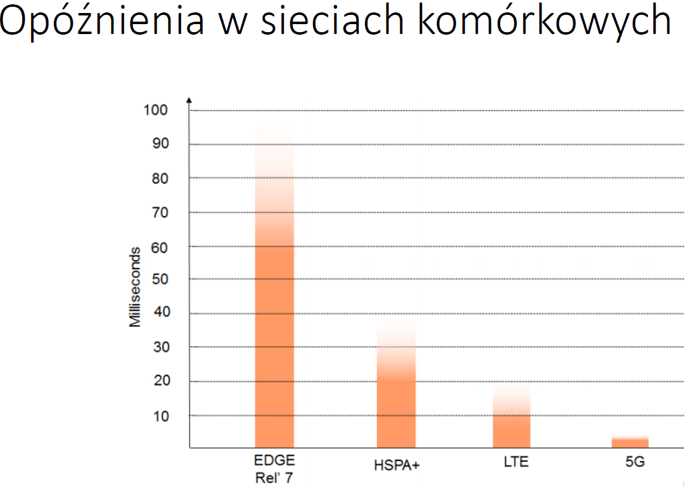

Dla nas opóźnienia rzędy 1ms w domu w 5G nic nie znaczą, ale w przemyśle, gdzie opóźnienia muszą być mega niska, to ma znaczenie, czy VR

 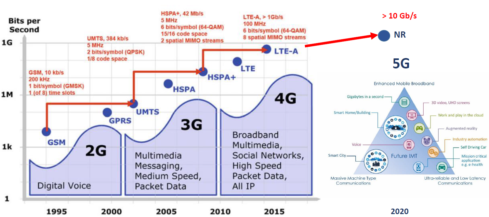

### Shannon

Rozwój sieci mobilnych jest niezmiennie związany z Shannonem.

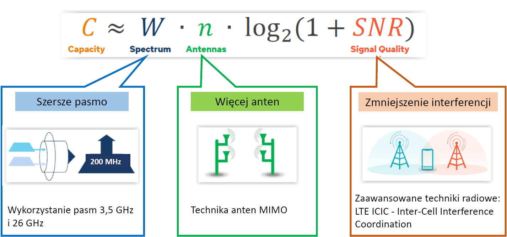

Cała zabawa rozwoju sieci mobilnej, to się odbywa wokół tego wzoru, bo:

- zeby zwiększać szybkość
  - Zacznamy z pasmem
  - jak pasma brakuje dajemy więcej anten
  - a potem SNR zmniejszamy (walczymy)

Rysunek na przykładzie LTE.

# B1 Sieci GSM (2G)

NSS - Network SubSystem. Później (jak się pojawiły sieci pakietowe) zaczęto to nazywać Core Network. 

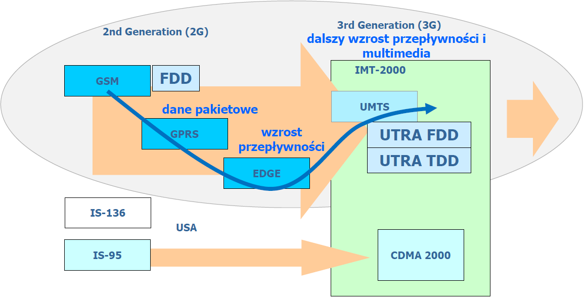

Z GSM pod postacią GRPS pojawiły się pierwsze w sieciach mobilnych usługi pakietowe.

**GRPS** - General Packet Radio Service

Potem powstał EDGE, taki poprawiony GPRS (lepsze przepustowości). 

Później pojawił się standard UMTS, tam HSPA to już w ogóle wywindowało przepustowość.

## Pierwotna idea GSM

Mieliśmy wtedy dobrze rozwiniętą sieć telefoniczną PSTN/ISDN. Były tam usługi pakietowe po kablu telefonicznym. No i wymyślono sobie:

> A jakby tak dołączyć do takiej sieci publicznej abonentów mobilnych, bezprzewodowych?

Chodziło tylko o to, żeby do sieci, któa już jest dokleić tylko dostęp radiowy. Okazało się ile z tym jazdy, że aż ten "dostęp" rozwinął się w osobną sieć. Także w praktyce okazało się, że trzeba zrobić odrębne sieci komórkowe. I dopiero coś co nazywa się Gateway MSC ma styki z siecią publiczną i ostatecznie się wykrystalizowali operatorzy mobilny.

Sieć ISDN była bardzo dobrze rozwnięta, zestandaryzowana i chciało się z tego skorzystać, żeby się nie narobić a dołączyć do niej. Budować tylko to co jest niezbędne.

Dlatego wzięto ISDN jako klasa bazowa i chciano ją zmodyfikować i stworzyć sieć radiową, żeby dało się tym dołączyć do prawdziwej ISDN.

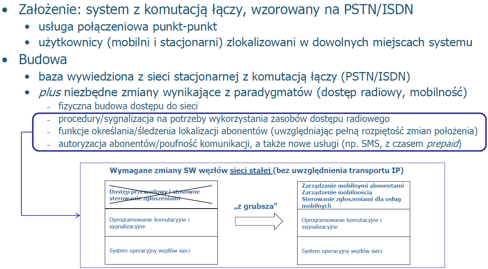

Czyli widać, że trzeba się zająć dostępem do sieci (bo jest bezprzewodowy i abonenci się poruszają) oraz sterowaniem zgłoszeniami, a cała reszta mogła zostać i być bardzo podobna jak to było w ISDN.

> I to widać w architekturze jak sieć mobilna wykorzstuje system syngalizacji nr 7, tak głęboko jak się tylko da. itd. Natomiast to co trzeba było dobudować, co wynikało z mobilności, to dorobiono.

## Generyczne aspekty sieci mobilnych

Nie tylko GSM.

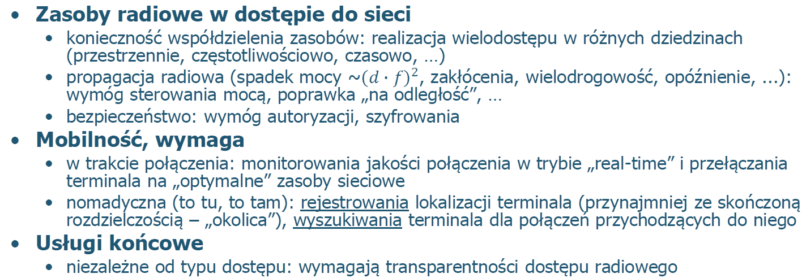

#### Zasoby radiowe

To jest coś co trzeba dzielić. To jest cenne dobro, więc nie może być tak, że ktoś je weźmie na stałe. Ubiegamy się o licencje, operatorzy mają je podzielone itd. No i jak ktoś już ma jakieś pasmo, to nie jest tak, że na stałe da abonentowi 100kb/s np.

Jak ktoś ma potrzebe to dostaje ten zasób, a jak nie ma potrzeby to mu się odbiera zasób i zwalnia go dla kogoś innego.  

==> Więc cały czas trzeba patrzeć kto co ma i zabierać oddawać itp.  Bo chcemy mieć jakoś usług (a to miała być sieć publiczna, więc niezawodność musiała być 99%), wszystko musi być pod ścisłą kontrolą. (nie to co w Wi-fi).

#### Mobilność

Po to mamy ten dostęp radiowy, żeby można było łazić czy jeździć. Przy wi-fi też jest jakaś mobilność, ale ograniczona (to tak jak przywiąże kogoś do drzewa i powiem, no jesteś mobilny w jakimś tam zakresie (zasięg sznurka)). Tu chodzi oto, żeby tego sznurka nie było. 
Mobilności są dwie:

- twarda - w trakcie połączenia
- nomadyczna - teraz jestem tu, potem pojadę do domu, a cały czas chcę być dostępny dla sieci. Sieć musi mniej-więcej wiedzieć, gdzie jestem, żeby do mnie zadzwonić

#### Usługi końcowe

W sieci telefonicznej był sam głos, a sieci mobilnego wprowadziły wiadomości SMS (Kiedyś to było używane do informowania od operatora, potem dopiero komercjalizacja poszła a dzisiaj to głównie alerty RCB.)	

### Poziomy/bloki sterowania

Z powyższych trzech aspektów wynikają 3 generyczne bloki sterowania:

- Zarządzanie zasobami radiowymi
  - blok funkcjonalny, który jest odpowiedzialny za zorganizowanie sposobu udzielania dostępu klientom do zasobu radiowego i pamiętajmy, to musi być w dwóch aspektach rozpatywane - płaszczyzny danych i płaszczyzny sterowania. Żebym ja mógł przesyłać dane, to muszę najpierw sieci to powiedzieć, i to powiedzenie odbywa się na tych samych zasobach radiowych. I na zasoby na data i control pane idzie jakaś rywalizacja i sieć musi to jakoś rozwiązać.
- Zarządzanie mobilnością
  - w aspekcie nomadycznym (od czasu do czasu terminal jak się gdzieś przemieści, to się rejestruje gdzie jest, żeby sieć wiedziała)
  - aspekt twardy (jak mam połączenie zarezerwowane, to może one zostać poddane tzw "handover'owi")
- Sterowanie zgłoszeniami
  - to bardziej realizacja usług użytkownika (czyli user robi coś z siecią core za pomocą sieci radiowej np. transfer pakietów (np. VoIP))
    - W 2G, 3G transfer pakietów to było coś kompletnie innego niż transfer głosu. Od 4G to jest to samo bo VoIP over LTE. LTE jest siecią pakietową a usługa głosowa to jest realizowana na tych pakietach właśnie. Sieć LTE nie widzi głosu tylko pakiety o parametrach do przesłania.

## Podstawowe koncepcje

### Komórka

Organizacja zasób w sieciach mobilnych odbywa się na zasadzie komórek. Obszarów relatywnie małych, które są pokryte poprzez stacje bazowe. De facto stacje bazowe to anteny. Przedstawiamy komórki jako hexagonalne obszarki, ale one nigdy nie są hexagonalne, nie ma takiej możliwości. One są kompletnie nieregularne to zależy od ukształtowania terenu, i wielu rzeczy jakie tylko sobie możemy wyobrazić. One zachodzą na siebie (jak nie zachodzą to mamy dziury (tak jak w tych moich bierszczadach)). 

>  Jak jest antena sektorowa, to ona jest w narożniku i jej "dzieci" wysyłaja do niej, a może być antena dookólna i jest na środku komórki

Teminal cały czasz mierzy co się dzieje dookoła (jaki zasięg skąd), jak wykryje ze jest w zasięgu lepszej stacji (zasięg lepszy) to się zamelduje w niej. Ale nawet nie - póki terminal jest w obszarze liczącym kilka komórek, to on tylko pilnuje czy jest w tym obszarze, czy on przypadkiem nie przeszedł obszaru, że on nie widzi żadnej z tych stacji bazowych, wtedy przerejestruje się mówicą sieci "jestem już nie w tej piaskownicy tylko innej". Żeby sieć mniej więcej widziała, gdzie on jest.
Natomiast jak on gada teraz, to cały czas śle komunikaty pomiary z tego co widzi naookoło. Terminal jak zaczyna połączenie to dostaje od sieci listę stacji bazowych, które ma monitorować pod kątem jakości sygnału i raporty wysyłać do sterownika. A sieć wie co się dzieje w kontekście innych stacji obok i sama decyduje czy nie przełączyć w końcu jakiegoś terminala na inną stację bazową. Np. jestem bliżej i mam lepszy zasięg (dB) z jakiejś stacji, ale nie ma tam zasobów to sieć mnie przerzuca (**handover**) do innej stacji bez wiedzy terminala.

Czyli sieć robi handovery i to się nazywa **centralny arbitraż zasobów**. Bo np. w sieciach pakietowych, terminal może sam zainicjować handover. W pakietówce opóźnienia 0.5 sekudny są spoko, ale w głosówce już nie. A nasz sieć ma mieć niezawodność 99.9%

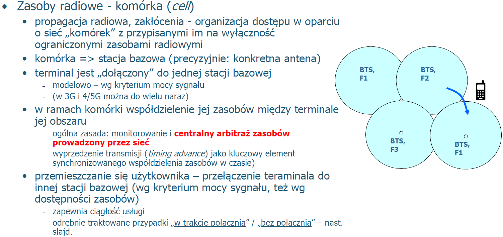

### Mobilność nomadyczna

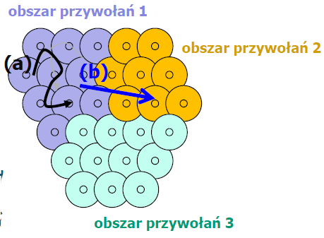

Załóżmy, że klienci sobie biegają, komórki są niezbyt duże i teraz mamy ich przepinać między komórkami, bo chcemy ich tak precyzyjnie mieć. (Cały czas nawet jak ktoś nie gada, to żeby go non-stop mieć). No i wtedy tak. Ktoś się porusza i zawsze jak zasięg jest lepszy w jakimś miejscu to przełączamy komórkę. Za każdym razem np. Ileż to tej sygnalizacji by było walone na darmo.

> To tak jakby mam pilnowała dziecka w piaskownicy każąć mu mówić co chwila przy którym kamyku on jest.
>
> To bez sensu. Chodzi o to, czy on jest w tej piaskownicy czy już w innej, wtedy groźnie. 

Obszary przywołań to są nasze piaskownice i póki dziecko chodzi w niej po kamykach to jest git. Ale jak przejdzie do innego, to chcemy od niego to usłuszeć. I to jest właśnie **nomadyzm** obszary przywołań wysyłają  info (parametry, nazwy, co umie itd.), żeby terminal wiedział gdzie jest, dostaje od obszaru liste stacji bazowych i pamięta. I nagle terminal nie widzi (słaby zasięg) żadnej stacji z listy, wtedy mówi "o kurcze przeszedłem stację bazową" muszę się przerejestrować. Odbiera od sieci nowy obszar i mówi do niej "teraz jestem tutaj, jak coś do mnie to tu szukajcie".  

> Jak dużo komórek to obszar, jak szybko się przełącza, jak często terminal dostaje info to wszystki sobie wylicza operator i on to wie na podstawie pomiarów, statystyk itp.  
>
> Operator robi kompromis, żeby sygnalizacji nie było za dużo, ale żeby też było ez znaleźć klienta, gdy przychodzi do niego połączenie.

Jak ktoś dzwoni do klienta, to sieć wie, w którym jest obszarze i wtedy okólnik z każdej stacji bazowej (broadcast) jest tam wysyłany  "ej, gościu ktoś do Ciebie, zgłoś się". I terminal wtedy odpowiada na tej, na której ma najlepszą moc. I terminal mówi do niej "dajcie mi kanał sygnalizacyjny, bo zdaje się to o mnie chodzi".

W mobilności twardej mamy zestawiony kanał i jego trzeba błyskawicznie przełączać przy poruszaniu się, żeby ani bit nie uciekł. I to jest realizowane wedługo paradygmatu *make before break*, póki terminal się nie przełączy do nowego zarezerwowanego dla niego zasobu w innej stacji bazowej, to cały czas korzysta z tej starej.

## Usługi końcowe

Usługi końcowe to były

- rozmówne
- wywiedzione z rozmównych
  - np. fax

Usługą z poziomu użytkownika była **Transparentność usługi względem mobilności**
A jej realizacją **zmiany wymuszone mobilnością** ( w tym *roamingiem*)

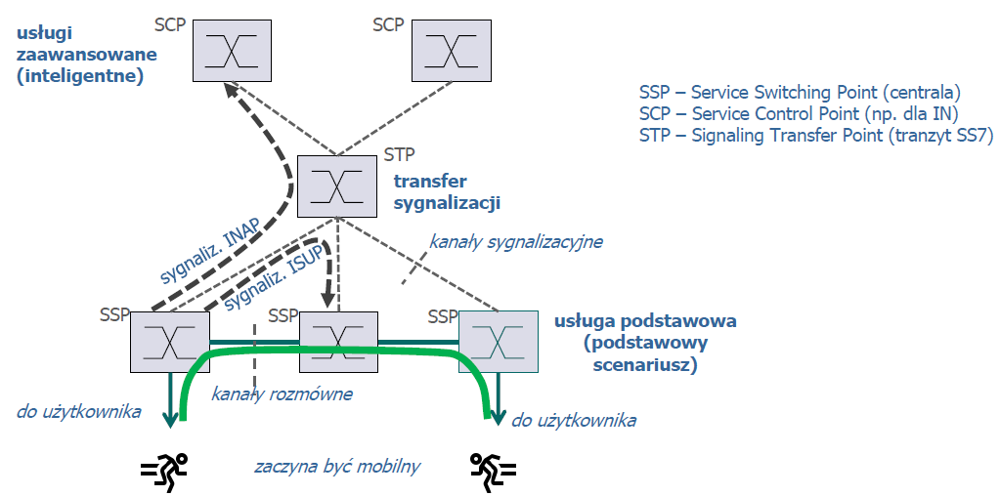

SSP jak user zaczynał być mobilny sygnalizowały to SCP, które były warstwą sterowania i jak kazały mu się przełączyć, to SSP wysyłał do STP a tamten do odpowiednigo SSP wiadomość, że zaraz tu się dołączymy. No i następny SSP sygnalizował znowy do STP, że następny węzeł to kolejny SSP i tak aż do SSP, z którem połączony jest user, do którego dzwonimy. Czyli widzimy już tu rozdzielenie płaszczyzny sterowania od danych.

***

Chcemy, żeby sieć była **transparentna** dla usługi. Co nas obchodzi czy tam jest jakaś mobilność czy nie, dostęp radiowy czy jakiś inny).

> Czyli, że user ma widzieć usługę tak samo bez względu na to czy korzysta z niej z urządzenia stacjonarnego czy mobilnego, czy korzysta z kabla czy z fal radiowych.

 **Więc trzeba zapewnić wsparcie dla transparentności**

> I to się nie da zrobić, bo każda sieć na świecie musiałaby mieć ten sam profil usługowy (zestaw usług) co moja sieć macierzysta, a wiadomo nie wszędzie na świecie jest tak samo. Znaczy takie podstawy jak rozmowy to i tak są wszędzie, ale jakieś bardziej pro rzeczy już nie, więc profil mój macierzysty nie wszędzie był honorwany, często gdzieniegdzie był okrojony.

## Standaryzacja GSM

GSM standaryzwało szereg ciał. Na początku GSM - ETSI, potem 3GPP się z tego wykrystalizowało od czasu R99 i do dzisiaj sprawuje piecze nad tym. Ważny dla GSM system sygnalizacji SS7 standaryzuje głównie ITU-T. Dodatkowo dla GSM z transportem IP następujące instytucje biorą udział:

- IETF - stos SIGTRAN
- ITU-T - protokół sterowanie zgłoszeniami BICC
- IETF/ITU-T - Megaco/H.248 (protokół sterowania bramami medialnymi)

## Punkt wyjścia dla GSM - PSTN, ISDN i SS7

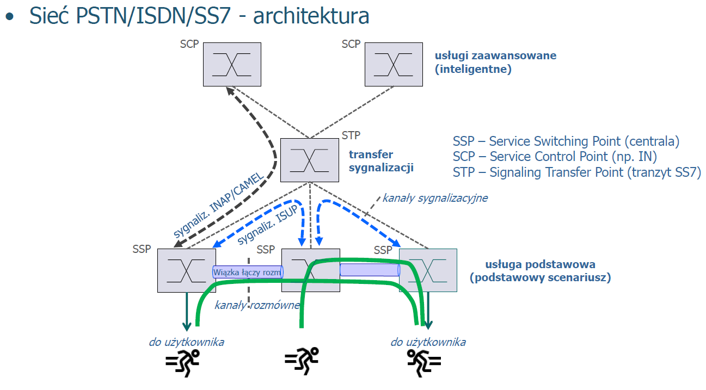

To są dwa rysunki dla sieci PSTN/ISDN/SS7

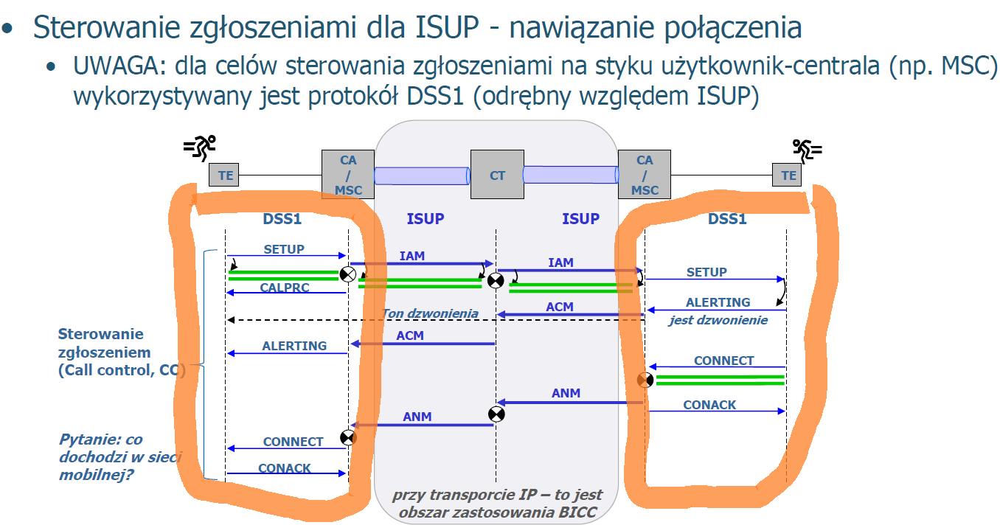

Mamy sieć stałą (między CA/MSC a drugim CA/MSC) i mamy dostępy radio do niej (obszar pomarańczowy)). W sieci komórkowej mamy zmian obszarów pomarańczowych. 

Więc w GSM:

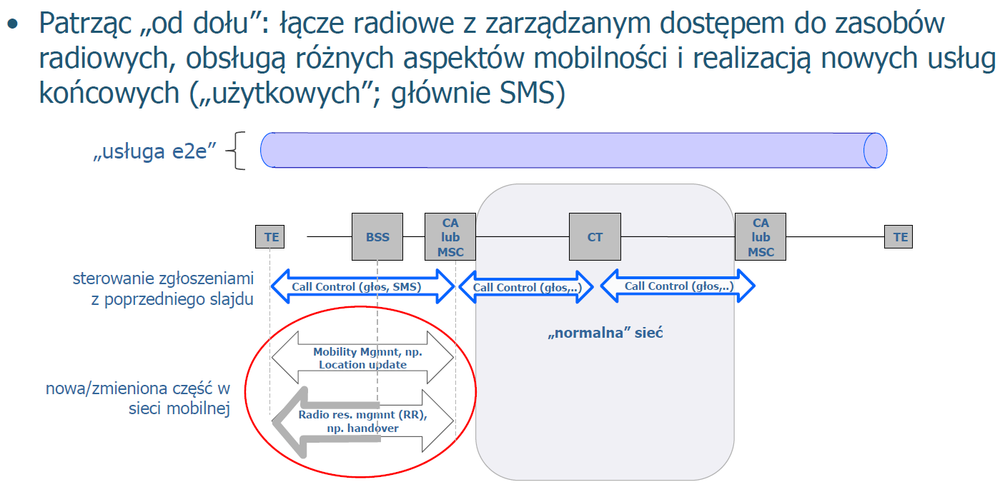

Więc w GSM zmieniono tylko dół (czerwona pętla), bo zmieniło się medium transmisyjne (drut na radiowe fale). W sieci stałej to się wtykamy kablem i jest, a tu trzeba zrobić radiowy dostęp do drutu.

 Wstawka o sygnalizacji

### Sieć ISDN

ISDN - Integrated Services Digital Network

PSTN - Public Switched Telephony Network

W niej działały protokoły:

- DSS1 -Digital Subscriber System No. 1 - system sygnalizacji w sieciach ISDN
- SS7 - Signallig System no. 7 - używany w sieciach PSTN

#### Architektura sieci ISDN

**TE** - Terminal Equipment, **CA** - centrala abonencka, **CT** - centrala tranzytowa, **STP** - Signalling Transfer Point (punkt transferowy sygnalizacji) SS7.

**SP** - Signalling Point (punkt końcowy sygnalizacji) SS7.

> W ogólności jest tak, że jest jakaś sieć i trzeba nią zarządzać, żeby abonencki w ramach potrzeby dostawali z niej zasoby. Inaczej się zarządza siecią pakietową, a inaczej w sieci z komutacją łączy (ISDN lub ATM). Zawsze istnieje blok funkcjonalny "Sterowanie zgłoszeniami" - Call Controll.

^Na rysunku to co odpowiada danym usera, to jest zielone (są to kanały rozmówne), są dwa bo kanały zestawiamy "w te i nazat".

**I jak do tego dochodzi, że są te zielone kreski?** Na początek ich nie ma, należą one do puli wspólnej a trzeba je zarezerwować dla jakiejś pary userów, którzy chcą gadać.

1. Po wklepaniu numery i naciśnięciu słuchawki TE wysyła wiadomość *SETUP* zdefiniowaną przez protokół **DSS1** (**Digital Subscriber System no. 1**), która oznacza "chcę się połączyć z jakimś abonentem (o podanym numerze)" (btw. DSS1 jest wykorzystywany w GSM i 2.5G i również w 3G w ramach toru rozmównego).
2. CA dostaje SETUP robi autoryzacje itp (CAC) i przedłuża (patrzy jak to trzeba skomutować najpierw) wysyłająć do CT wiadomość *IAM (Initial Adress Message)* z protokołu **ISUP (ISDN User Part Protocol)** i na jej podstawie (tam jest nr docelowy) jest komutacja i IAM jest przkazywany do następnych CT na podstawie jakiegoś tam routingu w tych CT.
3. Aż na koniec IAM trafi do CA (zauważmy, że w ciemno po drodze zarezerwowano zasoby, bo zakładamy, że user2 odbierze, bo co jak user2 odbierze, a okaże się, że nie ma zasobów w sieci? musimy mieć pewność, że są, więc od razu, w ciemno rezerwujemy).
4. CA wysyła do TE usera2 *SETUP* i wtedy telefon usera2 zaczyna dzwonić, a żeby poinformować sieć, że user2 został znaleziony i jest u niego odgrywany dzwonek TE wysyła wiadomość *ALERTING*
5. CA dostaje wiadomość *ALERTING* i przekazuje fakt znalezeinie i dzwonienia telefonu u usera2 dalej wysyłając do CT wiadomość *ACM (Address Complete Message)*, którą CT przekazują wcześniej ustalonym szlakiem aż do CA przy user1
6. CA przy user1 wysyła do TE user1 wiadomość *ALERTING* i wtedy w telefonie user1 odgrywany jest ton*, który informuje, że połączono się z user2 i czekamy aż odbierze.
   *tak naprawdę to CA, gdy obierze ALERTING sama po gotowym już torze rozmównym wysyła ton, że jest dzwonione u user2. (btw. to u user1 kierunek *up-link* jest zablokowany (co symbolizuje że nie jest pokolorowane na czarno prawa część kółeczka na rysunku w CA usera1))
7. Gdy user2 podniesie słuchawkę to jego TE wysyła wiadomość *CONN (Connect)* do CA i wtedy CA zestawia tor rozmówny między nim a TE usera2. Potem wysyła do CT wiadomość *ANM (Answer Message)*, która powoduje, że tor wcześniej zestawiony jest "udrażniany" (up i down-link działają wszędzie). I na koniec CA wysyła do TE usera2 wiadomość *CONACK (Connection Acknowledgement)*
8. Jak CA otrzyma *ANM*, to wysyła *CONN* do TE usera1 co informuje, że drugi user odebrał i, że zestawiono już połączenie. 
9. TE usera1 po odebraniu *CONN* wysyła tylko potwierdzenie odebrania w postaci *CONNACK*

#### Łącze między TE a CA od strony fizycznej

W ISDN TE z CA było połączone:

- dwoma **kanałami B**, który były kanałem rozmównym
  - Miały one przepływność `64kbit/s`
- jednym **kanałem D**, służącym do sygnalizacji (czyli przez niego przepływały wiadomości protokołu DSS1)
  - Miał on przepływność `16kbit/s`

I to wszytko bylo w jednym drucie telefonicznym. W warstwie elektrycznej podział na kanały reazlizował strumień bitów ramkonwanych i wnim były ramki, które nam wydzielały 2 kanały B i ramki od kanału D.

Z racji, że mamy dwa kanały B, to można naraz prowadzić 2 rozmowy, ale ktoś powie jak to dwie rozmowy na jednym telefonie?

Tak naprawdę to za tym TE były dopiero telefony i one były podłączone do TE i mogło być ich wiele i dwa naraz mogły gadać. Jakby trzeci chciał to by został odrzucony (ale cała procedura odbyła by się z CT, bo kanał D byłby wolny).

**Więc generalnie** wymiana sygnalizacyjna strukturalnie jest odrębna od przestrzeni przeznaczonej na rozmowę. Czyli w bitach były zdefiniowane ramki o długości ileś bitów, gdzie pewne sekwencje (pozycje) bitów mogły być zajmowane tylko przez informacje sygnalizacyjne, a inne sekwencje przez informacje rozmówną.

#### Po co STP?

Z pośród CT wydzielało się takie duże centrale i przy nich organizowało takie Punkty Transferu Sygnalizacji (takie jakby routery wiadomości sygnalizacyjnych), po to żeby ta sieć sygnalizacyjna, była nieco bardziej zagregowana (ofc nie screntralizowana), bo łatwiej tym zarządzać.

No i ostatecznie sygnalizacja sieciowa (^na rys. czerwona) docierała między centralami pośrednio przez STP (czyli jak CA/CT chciało coś wysłać do innego CA/CT to to szło przez STP).

Sieć systemu sygnalizacji była reazlizowana w SS7 przez **MTP - Message Transfer Part** (usługa relatywnie podobna do IP). MTP to taka pseudo sieć pakietowa na potrzeby sygnalizacji.

#### Protokoły sygnalizacyjne ISDN

Ten rysunek zakłada, że od sygnalizacji i danych jest jedno łączę.

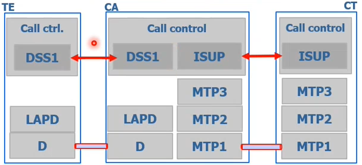

Jak czytać ten rysunek?

Wiadomość ISUP wymieniame między CA i CT nie lecą przecież sobie po powietrzu tylko zasuwają sobie właśnie przez wartwę:

- sieciową (protokoł MTPlayer3) 
  - komutacja się tu odbywa
- łącza danych (MTPlayer2)
  - zabezpieczenie przed błędami itp
- fizyczną (MTP1)
  - przesłanie bajtów

Wiadomości DSS1 między TE i CA są przesyłane przez:

- **LAPD (Link Access Protocol D-channel)** czyli protokół wartwy drugiej
  - od razu druga warstwa bo przecież nie potrzebujemy tu żadnej komutacji (TE i CA są na stałe połączone kablem)
- w warstwie fizycznej mamy wcześniej wspomniany kanał D (ten 16 kbit/s)

#### Pojęcia z tego rozdziału.

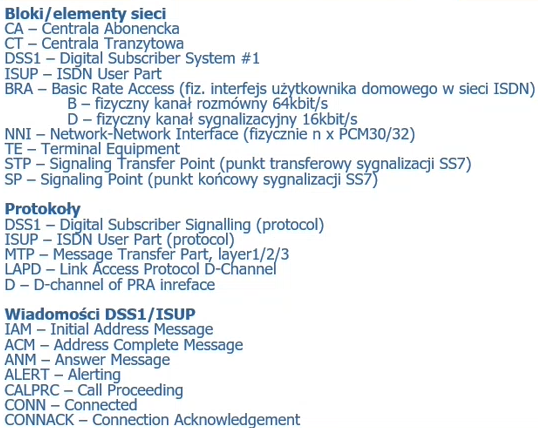

#### Podsumowanie

Wymiana sygnalizacji i danych użytkownika wymagają zasobów, które w ogólności* są "wspólne" i trzeba nimi zarządzać w czasie rzeczywistym.

*oprócz przypadku, że między TE i CA mamy BRA, gdzie jest dedykowany kanał D tylko na signalling.

***

Tak wygląda to w ISDN i teraz chodzi o to, żeby jak najwięcej z tych pomysłów wykorzystać w sieci GSM. Sieć mobilna trudni się tym jak zorganizować łącze między TE i CA.

***

### Sygnalizacja a sterowanie

**Sterowanie** to są czynności, które robią urządzenia z Control Plane, a **sygnalizacja** to komunikacja, wymienianie informacji między urządzeniami z Control Plane.

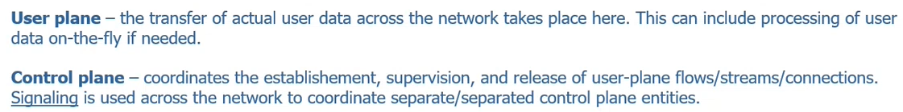

"Data Plane" jest nazywany też "User Plane".

## Signalling System no. 7 (SS7)

Pojawia się pytanie jak system ISDN należy zmienić, jeśli chcemy opatrzeć go w mobilność. 

Więc w jakich obszarach pojawiły się zmiany?

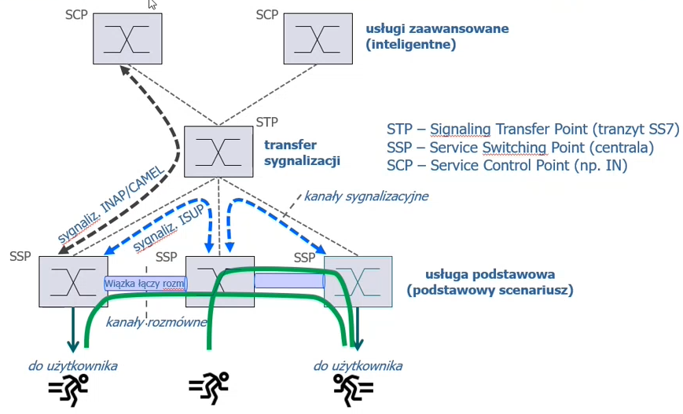

### Zmiany w usługach inteligentnych

**SCP - Service Control Point** - punkt sterowania usługami, który jest serwerem (dostaje zapytania co robić ze zgłoszeniami o usługę i odpowiada)

**SSP - Service Switching Point** - podrasowane centrale, które umieją takie zapytanie "co zrobić z danym zgłoszeniem, które jest w danej fazie z takimi paramsami" wysłać do SCP.

> SCP może odpowiedzieć np. "obsługuj to zgłoszenie jakby nic się nie stało" lub "obsługuj to zgłoszenie, ale zmień nr docelowy na taki jaki ja Ci tu podstawiam"

SCP służyła do sygnalizacji takich bardziej zaawansowanych usług jak przekierowanie numeró itp. natomiast w sieci GSM przyjęła ona formę takiej platformy **CAMEL - Customized Applications for Mobile networks Enhanced Logic**, która służyła wsparciu usług rozmównych i innych z uwzględnieniem roamingu abonentów (bo trzeba obiecane userowi usługi realizować też gdy jest za granicą). CAMEL działa tak, żeby jakiś rekord usługowy usera przewędrował z sieci macierzystej usera do miejsca, gdzie on jest za granicą.

## Co doszło w 2G do ISDN/SS7

Patrząc od dołu - doszło łącze radiowe z zarządzanym dostępem do zasobów, obsługą różnych apsketów mobliności i realizacją nowych usług końcowych (użytkowych) np. SMS.

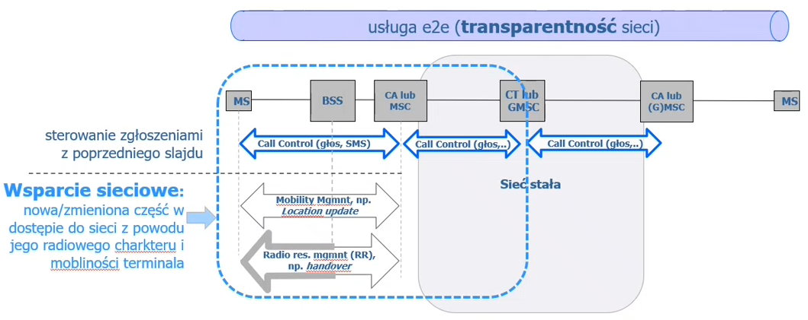

Z punktu widzenia sterowania zgłoszeniami nic nowego się nie dzieje. (ofc wprowadzenie SMS, ale to korzysta tak jak z kanału rozmównego i tyle). 

Dopiero w warstwach niżej zaczyna się coś dziać, no bo trzeba zamiast druta zrobić fale radiowe.

Wcześniej (w ISND) Call Control (protokół DSS1) chodził bezpośrednio na data linku a to na jakimś fizycznym łączu. Teraz sprawa się komplikuje i sporo doszło ze względu na dostęp radiowy i mobilność w niższych warstwach. 

> Są to dość trudne aspekty i sprzężone ze sobą dają dość skomplikowane rozwiązania (i tak ogólnie jest, że pierwsze podejście do problemu nie zawsze jest najprostsze, z czasem ludzie lepiej go rozumieją i upraszaczają sieć (arch. i protokoły), ale wraz z postępem G dochodzą nowe wymagania na usługi, więc to nie jest tak, że każde kolejne G jest coraz prostsze ogólnie jest, ale są nowe usługi itp i to robi systemy bardziej złożonymi).

# B1C1 GSM - Architektura  

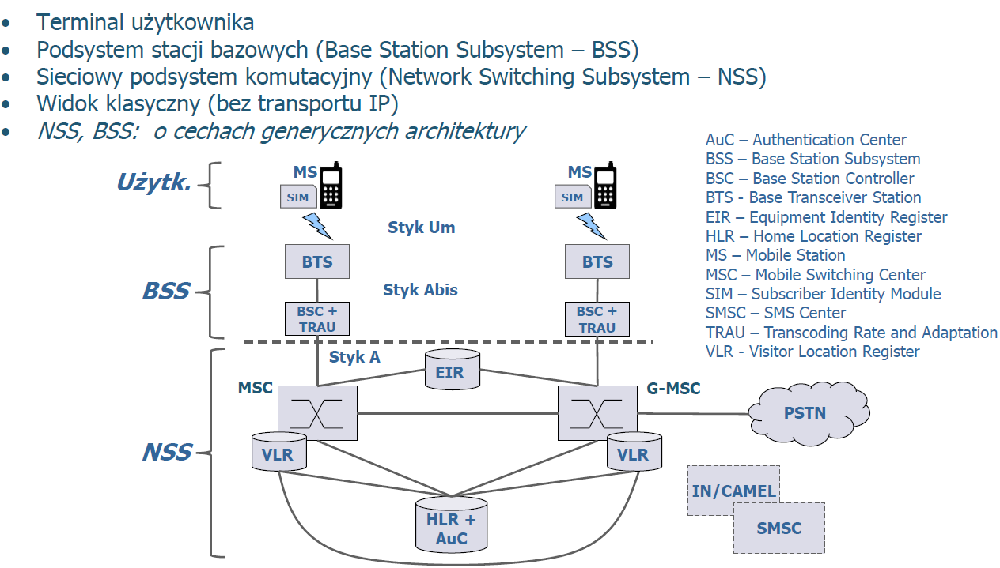

Mamy część radiową **BSS** - **Base Station Subsystem** (teraz to się RAN nazywa w LTE i GeRAN w UMTS) i sieć stała(kablowa), która się nazywa **NSS - Network SubSystem** (w GSM i GPRS, a w wyższych standardach CORE Network, a w 5G "5G Core").  

Część radiowa to zrobienie medium transmisyjnego, a cześć stała to pilnowanie tego medium i doniesieniem usług z perwspektywy klienta na styk sieci komórkowej, po to zeby ruch mógł wyjść "w świat". No bo sieć komórkowa robi dostęp do siecie publicznej, czy to Internet czy rozmówna publiczna. 

NSS robi autentykacje, uwierzytelnienie.

! Terminal u Użytkownik to są dwie różne rzeczy. Czym innym jest terminal, a czym innym SIM i człowiek. Mogę przełożyć SIM do innego terminala i still będzie działać. 

Dodatkowo sieć stała zapewnia dostępność usług w wymiarze ogólnoświatowym. Jak jadę do Francji, to chciałbym mieć roaming (tego nie zrobi lokalna sieć radiowa, to trzeba poziom wyżej, czyli sieć stała to robi)

> Jak się do mnie dzwoni z Chin a jestem we Francji, no to połączenie idzie do mojej sieci macierzystej, czyli do Polski, no bo skąd sieć Chińska ma wiedzieć, że we Francji jestem.  Dopiero mój operator w Polsce ma bazę danych z informacją, gdzie ja jestem i wtedy zależnie od technologii jakoś tam do tego połączenia ze mną dochodzi.

# B1C2 GSM -  Podsystem Sieciowy NSS

## Elementy i Styki

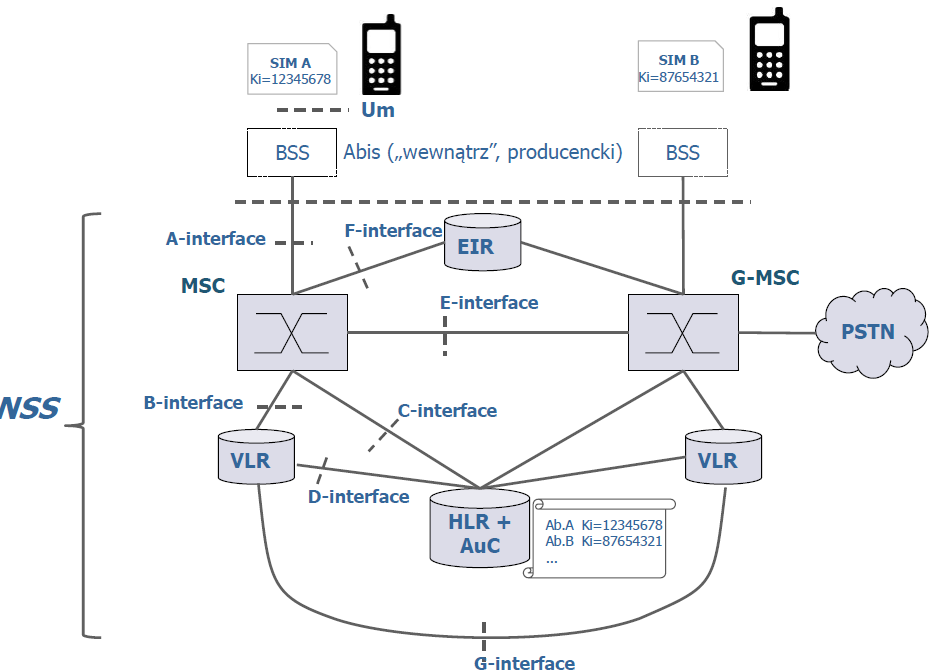

W PSTN były centrale, no to my też sobie wymyślimy jakieś.... ->:

**MSC - Mobile Switching Center** - centrum komutacyjne dla usług mobilnych, które jest taką upgradowaną centralą ISDN połaczeń głosowych. Upgrade polega np. na realizacji handoverów.

**HLR - Home Location Register** - rejestr macierzysty, rejestr gdzie na stałe są trzymane wszystkie dane o abonencie (nie personalne tylko te sieciowe - id karty, dane o sim'ie, klucze do szyfrowania, bieżąca lokalizacja z dokładnościa do obszaru MSC, gdzie on jest. Cokolwiek ja chce jako klient, to najpierw zawsze jest weryfikacja w HLR, czy user ma dostęp do usługi.

**VLR - Visitor Location Register** - rejestr lokalny, hierarchicznie niżej niż HLR. 

> np. Orange w jeden centralny HLR w Wawie. A ja jestem we Wrocku, tam już inne MSC funkcjonuje i z tamtym MSC jest skojarzone lokalne VLR i w tym VLR jest lokalne info o mnie gdzie jestem z dokładnościa do obszaru przywołań, której HLR już nie widzi. Ale HRL wie, do którego VLR uderzać, gdyby trzeba było mnie znaleźć.
>
> Jak ktoś z centrali G-MSC chce do mnie, to zagląda do HLR i kieruje się już do MSC skojarzonym z wpisanym tam VLR

VLR to informacje o wsystki abonentach, którzy akurat wpadli w obszar obłsugowy danego MSC. W tym sensie wpadli, ze znajdują się w podsystemach radiowych, które są dopięte do tego MSC. Jeśli klient przemieści się w obszar innego MSC, to odpowiedni VLR wysyła do tego drugiego VLR całe jego info.

**AuC - Authentication Center** - tu są klucze uwierzytelniające klientów.

**EIR - Equipment Identity Register** - rejestr terminali. Nie wszystkich, ale tych które są jakoś specjalne, np. kradziony jest na zastrzeżonej liście albo z jakimś innym statusem i na tej podstawie pewne rzeczy można z nim zrobić a pewnych nie. Nie z Sim'em tylko z terminalem. Generalnie to żeby kradzione wrzucać na black list.Sieć sprawdza czy jest kradziony i jak jest to żadnej usługi nie wykona.

**G-MSC - Gateway MSC** - taki MSC na brzegu z sieciami innymi niż ta operatorska (albo publiczna albo operatorska innego operatora (roaming))

> I taki schemat zachował się w kolejnych standardach. Jak rozumiemy to, to łatwiej nam ogarnąć te nowe G. Zmiany są głównie niskopoziomowe w radiu, bo inaczej się zasobami zarządza (inne częstotliwości, modulacje itp.) oraz sama pakietówka dużo zmian zrobiła.

## Jak przebiega połączenie

Spójrzmy jeszcze raz na ten rysunek

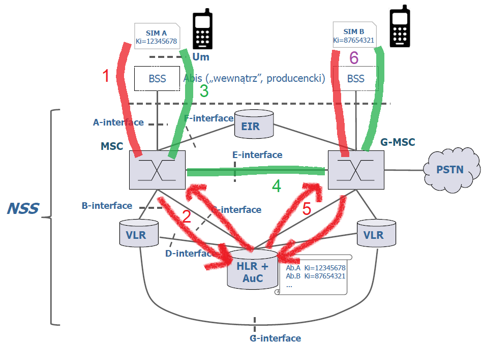

**Um** - urządzenie mobilne.

1. Um najpierw próbuje zarezerwować sobie kanał syngalizacyjny między nim a MSC.
2. Następuje CAC (czyli komunikacja z HLR) jak wszystko ok, to międz Um a MSC jest kanał sygnalizacyjny (protokół DSS1). Tu jest CAC, ale też ustalenie szyfrowania dla danej rozmowy.
3. Między Um a MSC powstaje kanał rozmówny.
4. Teraz MSC zestawia połączenie przez sieć aż do ostatniego MSC (tego gdzie jest drugie Um)
5. Teraz podobne procedury CAC (nie takie same lecz symetryczne) jak w 2. są wykonywane między dla Um2
6. Gdy 5. OK, to zestawiamy kanały między MSC a Um2

! Note that: krok 2. i 5. to abstrakcja, bo HLR jest przecież hierarhicznie rozproszone jako VLR.

## Elementy

### MSC

**Mobile Switching Center** - centrala abonencka sieci GSM.

- Ma swój obszar obsługowy ograniczony zbiorem przypisanych BSS (Base Station Subsystem) stacji bazowych. Jedna BSS podle zawsze jednemu MSC.

- Użytkownicy pozostający w zasięgu MSC (podpięci do jednego z jego BSS) są zarejestrowani w VLR związanym z danym MSC

**Główne funkcje**

- Na poziomie usług

  - Obsługa wywołań (gdy ktoś do mnie dzwoni, lub ja do kogoś - usługi głosowe (w tym też przekierowania itp.)
  - Przekazywanie wiadomości SMS

- Zarządzanie moblinością (Mobility Management)

  - uwierzytelnienie abonentów podcas inicjonowania procedur sygnalizacyjnych (krok 2. z rodziału wyżej) we współpracy z innymi urządzeniami
  - obsługa rejestracji terminala (po jego włączeniu) w sieci i obsługa wyrejestrowania (ofc znowu we współpracy z innymi urządzeniami)
    - zanim chipset wyłączy prąd u siebie to powie sieci "elo, ja znikam"
  - udział w aktualizacji położenia (location update)
    - też ofc nie samo, ale to MSC rozdaje tu karty

- Zarządzanie zasobami radiowymi

  - > MSC jest dość głęboko w sieci. Pomiędzy terminalem a MSC jest cały podsystem radiowy przecież.

  - więc -> wysokopoziomowe sterowanie zasobami w seici radiowej

    - np. polecenie przydzielenia kanału sygnalizacyjnego MS
      - terminal się zgłasza i podstawowe decyzje podejmuje MSC (nie zajmuje się wszystkimi detalami dostępu radiowego )
    - np. polecenie przydzielenia kanału rozmównego MS po poprwanym CAC (moment między krokami 2. i 3.)
      - MSC nie musi wskazać, który dokładnie na jakiej częstotliwości (bo tym zajmuje się sterownik częsci radiowej), ale decyzja czy przynać czy nie

  - sterowanie przełączeniem połączenia (**handover**)

    - ale nie na każdym poziomie ofc (zależy jak bardzo ten handover jest głęboki) 
      - intra-MSC
        - czyli terminal przemieszcza się w ramach jednego MSC, ale pomiędzy sąsiednimi BSC - taki handover musi explicite wykonac MSC
      - inter-MSC 
        - tu biorą udział nawet dwa MSC! Te między którymi terminal się przemieścił.

- Biling połączeń

### HRL 

**Home Location Register** - baza danych o abonentach - cała informacja o terminalu, jego uprawnienia itp.

Na sieć operatorską jest co najmniej jeden rejestr HLR/AuC

W tej bazie danych każdy abonent ma następujące wpisy:

- **MSISDN - Mobile Subscriber ISDN Number**

  - zwykły numer abonencki, który ja daje kolegom
    - jego format to CC + NDC + SN
      - **CC** - Country Code, **NDC** - National Destination Code (kod sieci operatora), **SN** - Subsriber Number
  - jest on publiczny, możliwy do zmiany
  - inny niż numer sieciowy IMSI (ale podony z wyglądu)

- **IMSI - Internaional Mobile Subscriber Identity**

  - międzynarowody numer abonenta 
  - max 15 cyfr
  - unkiatowy globalnie na całym świecie
  - przypisany na sztywno do karty SIM, karta SIM nigdy innego nie będzie miała
  - jest możliwie super tajny (chyba, że ktoś specjalnie sobie jakimś urządzeniem karte SIM przejrzy)
  - IMSI jest wykorzystywany przez protokoły sygnalizacyjne, a MSISDN to tylko taki ruting globalny
  - format:
    - MCC + MNC + MSIN
      - **MCC** - Mobile Country Code (3cyfry), **MNC** - Mobile Network Code (2-3cyfry), **MSIN** - Mobile Subscriber Identification Number (10cyfr) - unikatowy w sieci danego operatora

- **TMSI  - Temporary Mobile Subscriber Identity**

  - Chwilowy/ przejściowy identyfikator subskrybenta ruchomego
  - ten występuje w sygnalizacji bardzo często (IMSI występuje tak rzadko jak tylko można), zwłaszcza na styku radiowym to ten jest wykorzystywany IMSI tylko gdy nie da się inaczej.
  - on jest losowany, możesz być zmieniany co chwilę przy każdej kolejnej sekwencji sygnalizacyjnej. Chodzi o to, że jak ktoś podsłucha ten numer to co mu z tego jak za minutę czy dwie on się zmieni 
  - jest zarządzany przez akutalny VLR

- **MSRN - **Mobile Subscriber Roaming Number

  - >  żeby to wyjaśnić spójrzmy na strukturę adresu IP. On ma maski, tak, ale po co? żeby adresy były hierarchinczne, ale po co? Żeby tablice routingu były w miarę małe  (mieszczą się w zakresach ogarnialnych przez urządzenia). Jakbyśmy mieli płaski adressing (tak jak w ETH), to ile adresów, tyle wpisów w tablicy (5 mld telefonów to 5mld wpisów), to jest nie do ogarnięcia.

  - I to jest właśnie numer (znowu o podonym wyglądzie do IMSI), który służy do hierarchicznego rutingu w sieci ISDN.

    - Jak to działa

      - > Jak sieć dostanie zgłoszenie to po numerze MSISDN kieruje je do sieci macierzystej tego numeru i G-MSC odpytuje HLR tego numeru "weź mi podaj TMSI". Wtedy HLR po `aktualnym VLR`  odptyje o TMSI i odsyła to do G-MSC. Wtedy G-MSC rutuje połączenie pod numer MSRN. To jest chwilowy numer abonenta
        >
        > Czyli nie rutujemy po MSISDN (to jest jak FQDN - Full Quallified Domain Name w internecie, po nim się nie rutuje tylko za pomocą DNS zamienia na adres IP), tylko po MSRN.

      - Po MSRN dochodzimy do MSC, do którego jest połączenie przychodzące 

- **Aktualny VLR** - VLR powiązany z MSC, w którym to obszarze usługowym jest user

- **Lista usług** - lista usług dostępnych dla danego abonenta (te za które płaci i może ich oczekiwać)
  - Są w tym usługi podstawowe (basic services):
    - telefon
    - SMS
    - Fax
  - Ale i dodatkowe (supplementary services)
    - przekierowanie bezwarunkowe
    - przekierowanie w przypadku zajętości
    - call waiting
    - call hold
    - ...

### AuC

**Authentication Center** - Centrum uwierzytelnień.

Chodzi o to, żeby szyfrować transmisję na styku radiowym jak tylko się da dla:

- sygnalizacji
- mowy i  SMS

Jak uwierzytelnimy terminal to on sobie tam wylicza na podstawie pewnych algorytmów i kluczy swój klucz szyfrujący  i szyfruje transmisję. Sieć przeprowadza analogiczne, odpowiednie obliczenia i wie jakie są klucze szyfrujące i potrafią się dogadać szyfrując transmisję na styku radiowym 

AuC przechowuje indywidualne klucze **Ki** dla abonentów

- symetryczne - ten sam klucz Ki jest zapisany na karcie SIM (i żyją te klucze tylko tam)
- Ki nigdy nie jest wymieniany, nie pojawia się w sieci

Wszelki klucze do szyfrowania są wyliczane na podstawie kluczy Ki i jakiś zrandomizowanych wartości, które co chwila się zmieniają.

Uwierzytelenie:

- dla większości operacji wymaga się uwierzytelenienia karty SIM
- np. zawsze przy zestawianiu kanału sygnalizacyjnego do sieic

Szyfrowanie:

- klucze Kc dla indywidualnych transmisji na styku radiowym są wywodzone z Ki oraz lakiś zrandomizowanych wartości (ma to krótki żywot i nawet zhackowanie klucza Kc daje mi dostęp tylko przez chwilę)

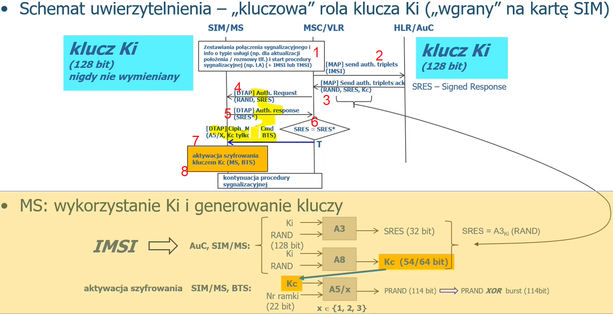

Ki jest na SIMIE i w AuC. 

1. No i w początkowej fazie gdy termianl mówi do MSC, to wymeniany jest plain text (zero szyfrowania), ale tam korzystane jest z numerów TMSI, więc to info nie jest ważne dla hackerów. 
2. Teraz MSC odwołuje się do Auc o odesłanie takie trojki liczb (**auth tiplets**), które potem posłużą do wdrożenia szyfrowania na styku radiowym.
3. Auc wylicza auth trplests, czyli -  **{RAND, SRES, Kc}**. Czyli jakaś liczba losowa, SRES - wyliczona na podstawie Ki i liczby losowej i Kc - klucz Kc (bo BTS musi tego używać a jest za głupi, żeby sobie to wyliczyć)
4. MSC wysyła do termiana *auth triplets*
5. Terminal teraz wykonuje podobne obliczenia jak Auc i wysyła swoje obliczone SRES oznaczone jako SRES*
6. Jeśli SRESy się zgadzają to jest git.
7. BTS dostaje Kc i używa go do szyfrowania na styku radiowym.
8. Terminal sam sobie liczy Kc

### VLR

**Visitor Location Register** - rejestr wizytantów

Blok zawsze skojarzony z MSC relacją @OneToOne. Implementacyjnie jest to kawałek MSC (w tym sam węźle po prostu)

- Przechowuje rekordy abonentów znajdujacych się aktualnie w obszarze obsługi danego MSC
  - Rekordy są kopiami danych zapisanych w HLR
    - ważne: dostępne usługi są wszędzie takie same (tj. jak w sieci macierzystej)
    - Czyli są tu:
      - numery: IMSI, MSISDN, TMSI*, MSRN*
      - LA (**obszar przywołań - Location Area**) te piaskownice z wcześniej
        - w VLR jest identyfikator LA
      - klucz Kc

*tak btw to TMSI i MSRN jest zarządzany przez VLR

### EIR

**Equipment Identity Register**

> Chodzi o to, ze rodzielamy. Czym innym jest sprzęt(terminal) od karty SIM. Karta SIM może być ok, ale wsadzona do kradzionego terminala nie zadziała. Terminal może nie kradziony, ale zła karta SIM (nie uprawniona) nie zadziała.

Rozdzielenie identyfikatora abonenta (SIM/IMSI) od identyfikatora terminala IMEI

 **IMEI - International Mobile Equipment Identity**:

- format: numer seryjny + typ terminala
- unikalny światowo

EIR to baza danych, która:

- jest odpytywana za pomocą SS7/MAP
- Zawiera listy
  - **biała** - dozwolone w danej sieci TYPY terminali
  - **czarna** - IMEI terminali niedozwolonych (kradzione lub zablokowane z innych powodów)
  - **szara** - IMEI terminali, dla których dozwolone jest śledzenie lokalizacji

Zapytania do EIR są dozwolone w dowolnych momentach podczas akutalizacji położenia (location update) i przy nawiązywaniu połączeń.

## Usługa SMS

Założona, że SMS to 160 oktetów, więc zastanowiono się czy potrzebny jest w ogóle zestawianie kanału, dojdzięto do wniosku, nie ma co tego prowadzić kanałem rozmównym i dlatego:

SMS w sieci radiowej jest przekazywany kanałem sygnalizacyjnym, a nie kanałem rozmównym. W ISDN nie było SMS'ów.

Więc SMS jest tak jakby usługą Call Control, ale tylko dlatego że przechodzi sygnalizacją.

SMS zawiera:

- nr MSISDN docelowego abonenta
- adres właściwego **SMSC - SMS Center** odczytany z karty SIM
  - dokładniej: nagłówek globalny SMSC wg SS7/SCCP
- tekst wiadomości

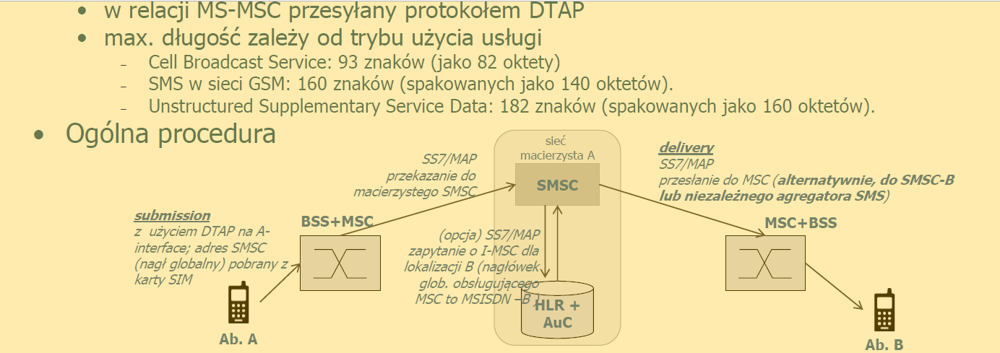

Struktura jest taka, że jest centrum SMSowe sieci macierzystej, czyli SMSC, które współpracuje z HLR, żeby wydobywać lokalizację terminala B

## Protokoły sieci stałej

### Protokoły w sieci stałej ISDN/PTSN/SS7 porównane z znanym dobrze stosem

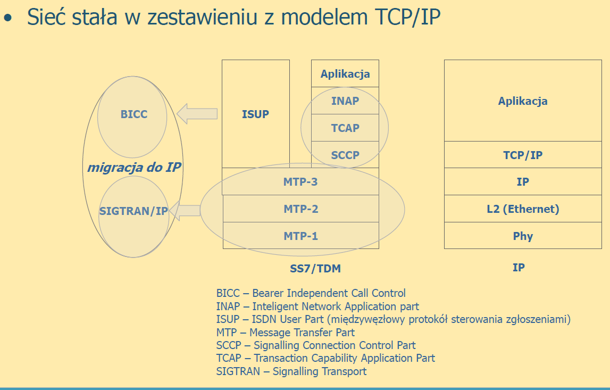

### Stos protokołów SS7 dla GSM + aspekty sterowania (CC, MM, RR)

CC - **Call Controll**, MM - **Mobility Management**, RR - **Radio R..?**

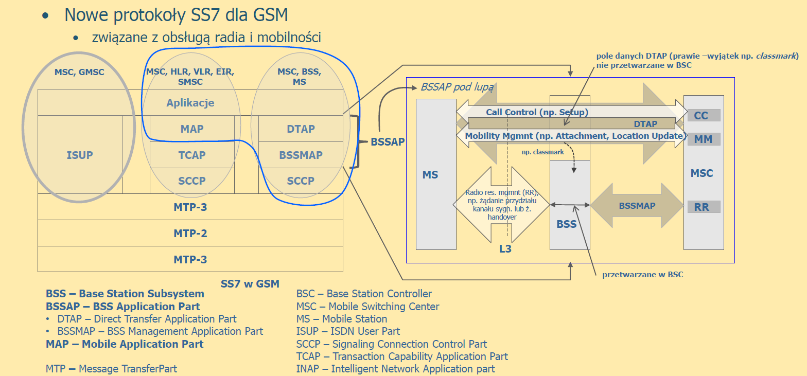

# B1C3 GSM - Podsystem radiowy BSS

Tera będzie to:

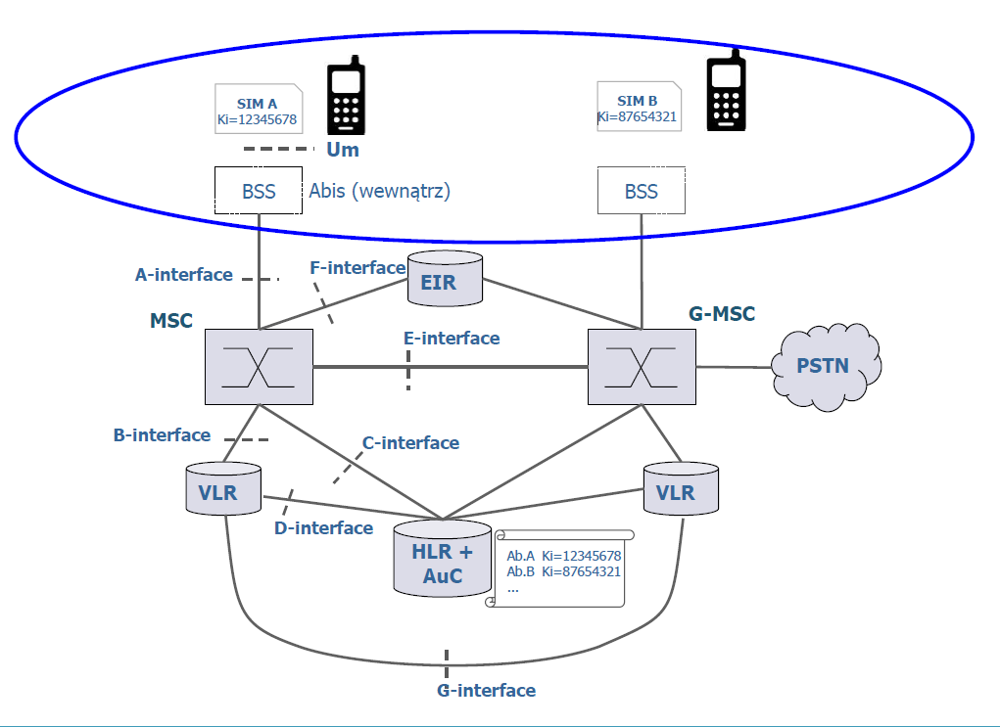

